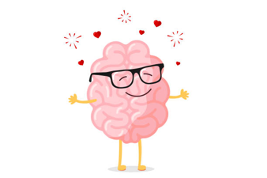

## The origin of univeron





嗯，是非常有创造性的名字呢。这就是我们的[**神经科学交流会**](https://univeron.notion.site/univeron/Univeron-76ad788f215440b59b1ee1e369b9ca8d) [^1]。

这一个小小的*社区*是我、灯灯、钟钟还有胡老师共同创立的，在大家（尤其是琦琦）的帮助下，逐渐变得小有规模。这里有生物医学心理学计算机各个学科的朋友们，听上去好像就是能够搞什么大事情一样🙌。

因为热爱*neuroscience*我们聚集在一起。不过，这里不仅是学术讨论的地方——正如灯灯所说：



我们不仅仅是学术的人，同时也是属于这个社会的。在思考怎么打病毒怎么构质粒的同时，也应该去思考这个社会究竟是什么样；思考我们应该如何去认知、接纳和融入这个社会，并且在其中做自己觉得合乎良心的事情。

**这还蛮重要的。**



如果感兴趣的话，欢迎联系我们加入其中👉👈

---

🔊从这里开始了解我们：

* [Notion资料库](https://univeron.notion.site/24eeb807aefe41559bde912b4be26621)
* [组织者的联系方式](https://univeron.notion.site/926b2d5977a5403692410655a5b38583?p=4b42d4b34c4c46039f537f17b08bf17b&pm=s)
* [交流会b站视频](https://space.bilibili.com/13678107/channel/seriesdetail?sid=443756)

---

虽然说，这座城堡凌驾于虚空之中。

但是热爱与喜欢总是可以模糊现实与想象的边界。不是吗？

[^1]: 点击访问我们的notion主页
