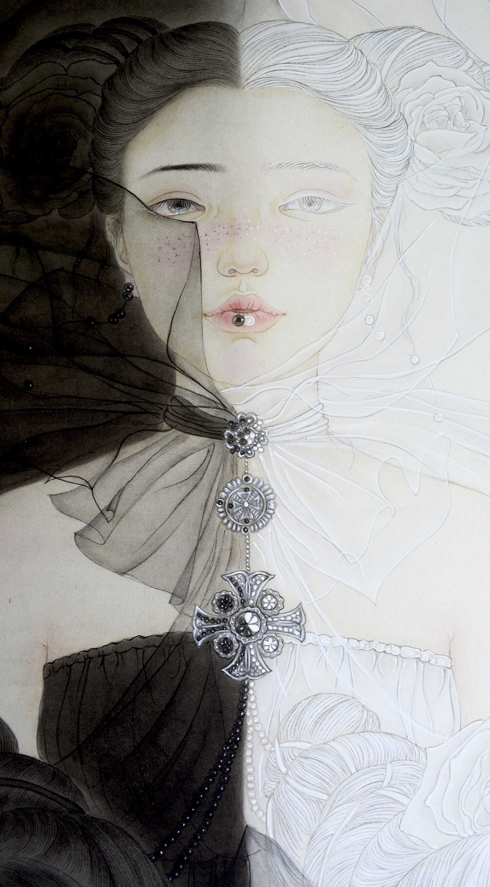

房间是白色的。白色的墙、白色的地毯、白色的床单、白色的窗棂，玻璃外是山谷里迷蒙的白雾，一只大鸟飞过，白羽。

p跪坐在床上，身着洗得泛红的黑色小洋裙，一头暗哑乌色波浪遮住她细弱的肩颈，微微蜷曲的发尖把那双水滴型的乳掩掩遮遮。白色棉被乱糟糟地耷拉在她的腰侧，遮住了右侧的半只大腿，缠绕过小腿，散开在床沿。勾挂在大拇趾上的摇摇欲坠的老旧黑色细高跟勾着观者的心魄，鲜红的指甲油已脱落得斑驳，却有一种微妙的颓唐从她周身弥散开。巴掌大的脸上，显眼的是她那被自己故意描画得极粗的眉，小而挺的鼻下，是涂成暗红色的唇。她的眼睛是大的，睫毛亦是长而浓密的，却不带美人的妩媚，乌黑的瞳仁里空空荡荡，隐隐透出一丝绝望与凉薄。

五点三十，这座山谷正在吐故纳新，一切都蠢蠢欲动，压抑的，要苏醒过来。可这个昏暗的房间却像是被遗弃在另一个维度，静寂得可怕，只有细碎的鸟鸣在窗边缓缓地流，遥远。

p在等待，等待红日升起。她知道，当灰蓝色的天空被染上绚丽的金红，僵硬的云朵被浸染得渐趋柔和，笔直的金剑会刺穿玻璃，照在她裸露着的干燥起皮的腿上，微微的疼。白色的床单上有不规则几何外形的阴影，盯着它们，双眼对焦，模糊后又清晰，各种稀奇古怪的浮想联翩，关于狄俄尼索斯，癫狂的流浪、传奇的故事、朗然的赞歌、驰骋的索尔——

和她。

对，她，伴着朝阳，携着晨风。p总会看见白色地毯上一双突兀的黑色布鞋，沾着山谷潮湿的泥土。那时，t会庄重地褪出自己光洁的脚，随着脚踝上黑绳拴住的银铃清脆的响，白色阔腿长裤朝着自己的方向摆开。精致的纯白衬衫，熨烫得没有一点褶皱，恰到好处地露出手腕那串菩提珠。干净利落的齐耳短发，棱角分明的下颌线，微微上扬的嘴角，不算挺拔的鼻，淡淡的柳叶眉。唯有那双眼睛，不太大，却澄澈至极不含一丝杂念的眼睛，你注视着，就那样注视着，一股暖流就那样涓涓淌出，一种温柔轻纱般把身体环绕着。且她的澄澈不是因为简单，而是因为丰富，那目光是包含一切色彩的白光，苦难吗，忍耐吗，宽容吗，仁慈吗，怜悯吗，还有什么，是厚重沉郁的没药香，从房间的下层重重地摔过来，想要把伤口再次撕开。气味迫使p攥紧领口的布料，抬头，看见了她，太不真切。眨眼，忽觉那清凉的风从微掩的房门溜入，轻快的，像她的笑声，滑过自己的皮肤。阳光尚暖，阴影层次分明，被风吹过的皮肤闭塞了毛孔，略有颤动。门在背光处，若有人影，只听，嘎吱、咔，关闭、反锁。黑色细高跟被拿走，整整齐齐摆好，靠在黑色布鞋旁。她真的来了，银铃丁丁当当地响。

那股清雅空灵的树脂香飘进鼻息时，p还没有缓过神来。t看着她猛然收缩的瞳孔，落出一串轻笑。和煦的晨光懒懒地打在p的脸廓，在耳朵上照出胆怯的细绒毛，金黄的，或是明亮得透明的，柔柔弱弱，不像她假装出的强硬和冷漠。t俯身上床，隔着棉被，环上p的腰际，修长的玉指覆上着软软的耳垂，温热的咬痕，落在p麻木的脖颈，催促平静的血管突突跳动，魅红散开。p咬唇，抬起颤抖的手指，拉扯t的袖口，想转身，躲开酥酥麻麻的痒，却只是把身体扭成更旖旎的模样。吻是热的，舌是柔的，牙齿是野蛮的，一路游走过，从喉头，爬上下巴，再到暗红的唇。唇彩早快脱落了，湿热的空气，熟悉地味道，回忆接踵而至，身体苏醒。唇齿交缠时，滑过上颚的战栗，一次一次累积，张合，远离，再纠缠着靠近。勾缠的舌尖，互换的唾液，银丝掺了红，吻起又落在嘴角、耳鬓，柔和的呼吸掠过轻合的眼。吊带向下拉，挂在臂弯，扯出身体间的被褥，紧密相拥时，不自觉施力的手臂，要把对方揉进自己的身体。落在锁骨的吻，左、右，起伏，离合，向下，圆挺的乳，淡粉色乳晕，与颓糜装扮不相符合的青稚，轻弹，充血，变硬，连迁着从头到脚肌肉使不上劲。含住，吸吮，肿胀的快感，迎合又逃离，单腿上抬，又伸直，绷直了的脚尖又蜷曲。p的衣裙被完全地脱下，t不徐不急地叠好，放在床头，又抖抖棉被，双臂一张，包裹住两人，全部。狭小的空间，急促的呼吸，用嘴去探花丛中的一点，灵巧的舌，轻的上下滑，重地左右拨，挑逗地画着八字圈，直到抗拒却满足的喘息从死咬的齿缝逸出，手指可以不费力的进入。温热的甬道，有节奏地吞吐、拉扯，舍不得被填充的饱足，而屈起的指关节，寻找皱襞的隆起，按压、搅动、抽插的模拟，一根、两根、三根，一节、两节、全部没入。手掌在前端若即若离地按揉，手指的运动毫无规律，只是把快感的浪潮打来，一波未平一波又起。

p掀开被的一角，大口喘气，惨白的脸蒙上了红晕，眼睛从空洞变成迷蒙，欲拒还迎。她的发被金色的阳光晕染着，没有平日的憔悴，贴在汗涔涔的额角，雪白身体上的暗红印记，显示着两人的亲昵。t抓住她因快感而胡乱摇摆的手臂，解开白色阔腿裤的纽扣，解开白色衬衫的包裹，随手扔出自己的衣物，白与白交织融合，不见踪影。t用双腿夹住被褥，被褥包裹着p的右手，挤压，身体缓慢而用力地摩擦。p像往常一样，小心翼翼地触碰t的肩背，在她浅褐色的乳头上绕划，动作圣神而庄重，t能感到那羽毛般轻轻的触碰，没有任何力量，却充满了挑逗。腰、腹、大腿，皮肤越来越敏感，快感累积得越来越多，直到一种空虚，从下身传来，渴望着被填满。她在p的耳边发出一声似哀求又似哭泣的绵长呻吟，左手的进出加快，p不由得抬高腰部，又脱力地放下，摸索枕头下的白色的雪人。打开塑料壳，按键，t自然地打开双腿，私密处的森林深处如同泉水滋养过一般，轻松装进雪人震动的头。两人四肢纠缠，热烈地拥吻，发丝缠绕，花蕾尽情地绽放，从滞涩僵硬，到温暖柔软。嗡嗡的震动声，扑哧的水声，或压抑或坦率的呻吟声，带着气音的笑声，麝香混合着乳香与没药香，气味在纠缠，身体在厮磨。最后，脑海中仅存一条细若游丝的线，只有取悦对方的机械动作，制造摄人心魄的快乐，手脚发软，阵阵酥麻要把自己融化掉。攀登快乐的顶峰，快到极限了吧，激烈的挣扎扭曲，内部的折皱开始波浪的起伏，有节奏的收缩，强而有力，意识游离......情欲炽烈燃烧殆尽，沉浸在情感满足的余韵，摆出毫无抵抗的姿态。

当那段随着高潮余韵的漂浮结束，两人头脑归于清醒。相扣的十指倦怠地分开，无言无声，已知现实悄然走来。

**黑暗渴望光明，破碎祈求完满，束缚期盼自由**，痛苦的心会虔诚地祈祷，却祈不到生命的平静与安宁。**我们只知道在宇宙的阴面，黑色在等待救赎，却不知在宇宙的阳面，白色在等待罪恶弥补完美的缺陷。** *地狱和天堂都是极美，丑陋尽在人间*，而地狱与天堂间的极乐通道，是性爱中那穿透身心的快感——那么堕落又那么壮观，那么糜烂又那么神圣，那么疯狂又那么温柔，那么痴迷又那么冷静。野兽般地纠缠、撕扯，品尝你的肉你的血，锋利的爪牙留下怜惜的伤痕，紧密的拥抱、窒息的亲吻、挣扎的快乐、被诱惑着神志不清地索取哀求。彼此被驯服，筋肉交缠，灵魂互通，在感官的顶点，火球般燃烧的身体止不住痉挛。是醉了吗，情绪终于被发泄，生命力降到最低点时，本能禁止了穷蹙绝望，开始愉快地接受生命的反复无常。没有理性和秩序的世界里，去追求狂热、过度和不稳定。***黑迷恋白，白纠缠黑，于是造出了无尽的灰色地带。***

山谷中雾气散开，窗外阳光明朗，鸟鸣清脆。房间似乎不再是结界。

她们沿着各自的生命线，继续走在这个黑白混沌，道不清喜怒哀乐的世界。
