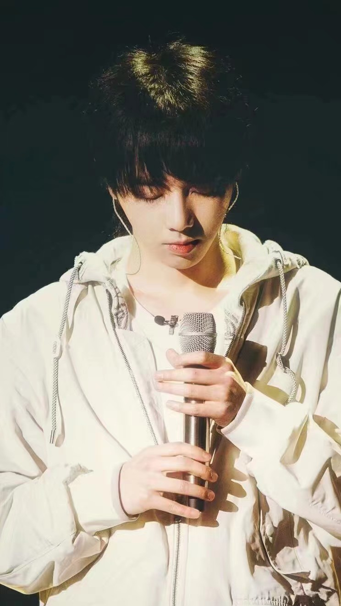

> *谨以此篇献给这个名字的人设。*



---

一三年的秋天，父亲正痴迷于某音乐综艺。在他未退出的播放界面上，我第一次知道了“华晨宇”。他揣着一台把电子琴，上台时是羞涩腼腆，却唱了一首无字歌，疯狂撕裂。

那时的我正试图结束自己过早到来的叛逆期，驱散满身的戾气和不招人待见的孤癖怪异。于是，听罢这首吸走我魂魄的歌，像是在逃避过去一般，我关掉了视频。

这一关，就是四年。

是的，四年，四年时间，“华晨宇”这三个字甚至不属于我生活的副线，它只是出现在我无心关注的花边新闻，伴着评论区骂声一片。可四年，就是这四年，我却亲历着他之后唱出的“爬山坡的自我成长过程”——被打破遮天蔽日的围墙，被放下未见天地的孤傲，敞开后受伤，不知要怎样，迷迷茫茫地寻找着，似乎穿越了“我”的迷雾，却又似乎在原地游荡。

直到二零一八，再遇。

很简单的起因，还是一段视频，只是这回没有匆匆关闭：他一袭白衣，眼神坚定而干净，口中浅吟低唱的，是听不见的美丽。音乐流淌，节奏敲击，我也悄悄把鞋带系好，要闯过无情的时光。

其实，打小五音不全的自己，从未想过音乐有这样的魅力，我竟捡拾起荒芜许久的钢琴，打开久未更新的播放器，生疏的手指奏不出绝妙的乐曲，便把他的世界细细聆听。又偷偷地写下关于他的散文诗，写桀骜不驯的魔王，写默默燃尽的烛光，写美与人生的交互，一支笔，一张纸，全部的心。当耳机里播放着的每一首都成了华晨宇，我发现自己已慢慢改变了。被大人骂“老气横秋”时，以为自己看清了一切，在明智地回避，却是他那直击人心的歌曲，让我重新找到生活的激情。最爱那首《癌》：挣扎的轮回，绝望的斗争，看似残酷，却听见了本能的生命力。

后来看他的访谈，我爱上了他的小世界，音乐之外那透明的世界。我不知道那要多么强大的心灵和聪慧的头脑，才能构建出如此广袤的天地，无边无际。我遇见过那么多人，令我心仪的灵魂多半只居住在名作佳篇，现实中，如此清醒而勇敢的，华晨宇且是唯一。他那么清楚地看到生命流动的本质，不谈利他利己的话题，做着自尊自强的修炼。尽管我深知网络带给我们的，不过一个人碎片化的一面，我仍固执地相信自己拼凑出的明达善良，是真实的存在。他不过静静地照亮，却让我于迷雾中将自己寻到，去向世间袒露真实，不再害怕梦想的荒唐。“华晨宇”，于我，或许不是一个人，而是一种态度：在这荒诞的生活中，接纳一切的尘埃落空，争取所有的可能未知。

这就是我和华晨宇的五年，两条时远时近的生命线，汇合在恰当的时间，欢喜忘言。有时会羡慕那些陪他一路走来的火星人，经受了我未曾领略的风雨，分享了我未曾参与的喜乐，他们是怎样坚强，才壮阔了这红海的波涛。当我终于化为这红海的一纹，却庆幸与他错失四年的时空，实在是一种妙不可言的缘分，曾经那个乖戾从众的我，会给他带去重重伤害的我，未曾阻碍他自由地歌唱。

有时把自己关在漆黑的房间，唯有香炉，红光一点，我总害怕世界旋转折叠，把相似的灵魂遗弃在孤独的异界。所幸现在，有了你，有了一个个值得守诺的五年，指尖触及的空气多了些温度，未来也不再是迷途。终止在何时呢？无人知晓。但你就飞吧，越高越好，飞出现代的迷楼，飞上九万里长空，飞到宇宙的另一头。我们的大魔王，二十一世纪的伊卡诺斯，我们会给你造一双，不被阳光灼断的翅膀。

*这一次，不离红海。*

***后记：***

嗯，这是我一八年写下的文章，投稿未中，却还是把它打印出，小心翼翼地粘贴在了那本杂志的背后，仅作留念。而今再读时，不禁有些感慨：不知不觉就在这片温暖的红海，停留了两年的时间。

其实呀，也突然就发现自己，慢慢地发生了好多好多我从未设想过的变化。没想到有一天，我竟会爱上以前嫌吵的说唱，跟着爵士乐点头，享受摇滚的狂欢——在那个只属于节奏和音符的世界里，旋律离开了文字，却仍然有独特的魅力。这是另一种表达啊，从思考到情绪，那一首一首，我知道我能听见：孑然一身的孤独，被排挤被遗忘的伤口愈合不久又裂开；狂傲不羁的反叛，对世界对舞台对一切抛弃纯真的成长。在这片土地生存的我们，什么时候才能不用破坏换发展？那流着泪躲藏的人群，什么时候才能被接纳被关爱？或者洋溢一份真挚的感情，给爱人给朋友给你们的陪伴；或者徜徉在无法触及的维度，任思绪奔腾在红尘外优游自在。五线谱，休止符，用数字的逻辑编撰情感的潮涌，那些吟唱着的柔情，咆哮着的嘶吼，是音乐人们在用他们的方式，创造的美丽遗产。我发现我还是会喜欢着或是厌恶着什么什么，只是不再凭自己的喜恶对它们加以善恶好坏的标签。对，还有他们，从音乐审美到为人处事，我感受到自己在逐渐去包容、去理解，用一种接纳的心态去看待周遭一切——那些互异的、矛盾的，甚而是与自己相斥的，我都慢悠悠地知晓了他们的价值所在。不是去认同所有，更不是没有原则的妥协，我只是把固执己见的外壳褪去，把那些刚硬尖锐换成善意柔软。而当自己真正这样去做，才发现眼前的风景是怎样的辽阔。

很难说，华晨宇到底带给了我什么，从某种程度上讲，我们是太相似的那一类人，灵魂或许是同一块拼图的碎片。那些细腻敏感的小心思，那些不吝于儿女情长的大爱，那些孤独那些痛苦那些天真那些自在，我只有一支笔，他只有一个话筒。红海，那红海，那片一年一年都让人潸然泪下的红海，这是他的家，亦是我们的家。他从不要求我们去爱他，追随他，去为他做什么，甚至那时，被爱包裹的他，害怕到要躲藏，回去一人对着那白墙，回到只有钢琴的小黑屋。但是这么多年了，他适应了这个所谓"明星"实则歌者的身份，他感谢我们的爱，自言"无以为报"，便只是去唱，唱到舞台下空无一人。他是个很有仪式感很有主权意识的人啊，会在每年生日发一模一样的照片，会在五月天的演唱会给我们打来"电话"，会在发微博时故意选定时间；会在舞台上说一半的话给我们留下另一半，会讲我们才知道的暗号，会插科打诨却也随和温暖。这个身份，注定了劳累，却也只有这样，他才能去带动去号召——用一种更加积极向上的姿态。

我知道，他已经有了一双翅膀，飞得出迷楼，不会被太阳熔断。

我知道，我会奔赴一年一度的约定，尤其是，这特别的2020。

我知道，不离红海，其实早就离不开红海。

