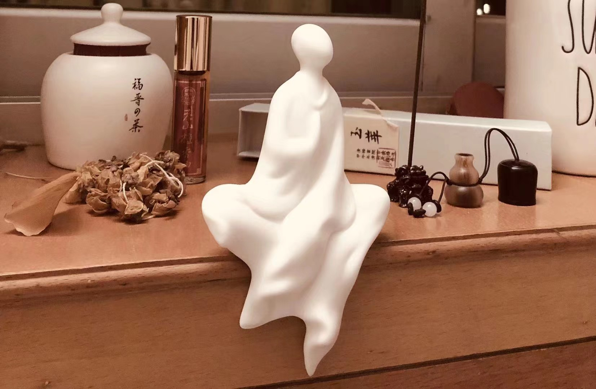

秋天啊，秋天，是金黄遍野，枫树林燃成一片；是天高远，云疏朗，雁飞向南，溪水泠泠越过坚硬的石块；是有些萧索，有些忧郁，却又灌满了丰收的喜悦，期待的甜蜜——当二十四节气的轴轮又滚动到这里，我想要铺开被搁置潮湿的记忆，关于我们的青春，我们的友谊，我们的秘密。

你记得吗，在阳光很好的午后，木樨被熏蒸了，香会格外浓烈些。喜欢这温暖光芒的你，总会摘下黑框眼镜，高度近视的眼睛看不真切，但溜圆乌黑的瞳仁还是闪烁着着童真与顽皮。我效仿，不管四周的世界全变成模糊的色块与光影，拿起我的保温茶杯，里面是还会烫着舌头的飘雪，或者热气腾腾的毛尖。你喜欢牵起我的手，用你肉肉的，小小的手心，十指微扣，一起摸索出教室，趴伏在走廊贴白色瓷砖的阳台。秋日的阳光本就不会炙热，透过浓荫的树，柔柔地落在脸上，能猜着看见你耳边，被熨烫出快乐的金色绒毛，能真实嗅到你周身，流淌着一种怜抚的味道。我们静默着，拧开各自的杯盖，任由水蒸气扑面，挂上长长的睫毛，逼出鼻头的点点汗水，吸入混合着从彼此身体离开分子的，醉人的空气。教室里有同学一阵一阵的起哄，或者谁严肃认真地讨论题目；走廊还有人跑来跑去嬉戏打闹，叫喊掠过我们，却构不成打扰。此时的声音已到不了，我们用灵魂联结开辟出的安静异界，你用杯盖给我盛核桃分心木泡出的水，微微苦涩，是我喜爱的口味。多好，这样的时光，你曾在一封信里写到，在那些金色的午后，我们终于褪去了演出的外套，我们交换了真实，那些不曾说出口的悲伤，用微笑，用拥抱，用流淌着的醉人的空气，把身心舒畅。我似乎很难再像这样敞开心扉，不戴着网络的面具，不施以隐瞒的真相，就那样安安静静地停留在弥散的安全感中，嘴角上扬。

说到写信，第一次写信，已经被模糊了的原因。或许是那段时间的自己听了太多上世纪八十年代文艺青年的故事，就特别想把自己的多愁善感装进信封，装进泛着墨光的字迹。是在深夜，完成一天的课业，母亲已经在隔壁房间睡熟，我偷偷拿出藏在抽屉深处的信纸，裁出一条，开始一个人的叨叨唠唠——就像我的语文积累本一样。似乎那时真的很少有人像我这样，过分认真地写这个作业，其实只是情绪无处宣泄，用复杂的语句、凌乱的表述和晦涩的隐喻，说着不愿被人分享的故事。有多少人只是带着猎奇看了呢，又有多少人像你这样愿意给我一篇长长的回复，我的幻想、我的孤独、我的格格不入、我天马行空的思考、我无限扩大的欢喜悲愁，你不仅理解了，还用真诚去抚平我的伤口。那些书卷气的落款，精致的信纸，你一笔一划写下的文字，我在泛黄的灯光下，读着你的心情，仿佛看见了你皱起的眉头，听见了你略带安抚的口气。你说我带给你清醒，带给你剖析自我的勇气，让你不用麻木掩盖痛觉神经——而你带给了我安宁——能够在深夜酣然入梦的安宁。只有你，会在我笑着时露出心疼的表情；只有你，害怕我只会爱别人，不会爱自己。

后来你闹着要给自己取字，说是女孩及笄之时必要的仪式，翻了多少诗词歌赋啊，还是犹豫不决，天天缠着亲爱的语文老师。而在你纠结的时候，我花了一个晚上的时间，满意地把自己的名译成“向来如山间雾气般变化不定”，就这那句“月望无常历”，也就迟到一年吧，定好了我的字——“月望”。被知晓后的你气鼓鼓盯着，只好又耐心地等着你看完《离骚》，爱上那句“[及年岁之未晏兮，时亦犹其未央](http://www.baidu.com/link?url=RsrG4MGadEkCFBhDzFMRoT9duu8giO6QmwJVs3Z_1jdRD35WzzcWLaKa7AMDFXTy_1Jgvnsw3NRnN6dqBL6tVpM5R60J98mJHjrCtJFsvje)”。你取出“未晏”两字，带着小小雀跃，分享其中的故事——你叫“妍秋”呀，当时年岁恰若这诗情画意的季节，要趁美好年华尚未逝去，给生命留下一些值得珍藏的美好。之后的信中，我唤你未晏，你称我月望，这是只有我们才知道的秘密暗号，使我们相视时，露出狡黠的笑。现在当我又翻出那些信封，打开那些信件，又看见了“永远”的出现。记得刚写信时谈到我们，我总是不愿意给这份友谊加上这样的期限。就是单纯的害怕吧，害怕朋友变成旧识，害怕分割两地后人生不再有瓜葛，害怕我们慢慢变成彼此记忆中的陈旧标签。而白纸黑字看见，你总是在对我说“永远”——坚定地，一遍又一遍——坚定到，让我在最后的那封信里，也坚定地写上了永远。“永远”，这样的承诺，对你，我情愿用一辈子实现。当我轻轻整理好属于我们的信件，手指抚上你采撷的银杏叶片，伴着金桂的香氤氲心口——更多记忆涌出，或清晰或隐约的画面。

第一次遇见，你顶着红彤彤的脸，夸张的笑用来掩盖登台的羞赧和紧张，唯一一个把自己的名字诗情画意地介绍，不得不记下你洁白的牙齿和好听的音色；当英语小组长，和从小的损友竞争让你到我身旁，放肆地夸你漂亮，就这样结了眼缘；你主动打开话匣子，说自己是动物园园长，一脸傲娇地说我是松鼠，有蓬松的头发，走路还一蹦一蹦，就知道你真的是个喜欢观察生活的女孩子；那次生日送我顾城的诗集，书签留在《你喜欢歌谣》，念着那句“花开如火，也如寂寞”，你还能品味到欢乐，而我只见忧伤；那尊白佛也还坐在木制书架上，“修正道，得轻安”的卡片我有好好收藏，虽然生活总是想偏离我喜欢的方向，还是会看那首自己写下的不合平仄的诗，诵出那句“相顾无言情自知”；红色塑胶跑道上，你逆着阳光向我奔来的身影还没有离去，眯着眼看你飞扬的发丝和宽大的蓝黑校服，有种冲动想要时间静止；是晚自习后一起散步操场，说着一天来的烦心事，谈恋爱了，那个男孩多无理取闹，我置身事外地帮你分析，没想到第二天你还是哭红眼眶；高考后一起窝在书店，听你大声嚷嚷终于能把想看的书看个遍，一起去商城嘲笑我瘦得穿不了衣服，去锻炼然后娇嗔着埋怨美食的图片；在军训后寄来你的明信片，看着你熟悉的笑脸，右手指着天空圆圆的月，在网络上大张旗鼓地“秀恩爱”，只是因为思念挣扎着从浙江的雨飞向北京的雪；跨年夜磕磕绊绊地拨打语音电话，和你一起观赏我们的舞台，期末考试后煲五个小时的电话粥，高铁上不管极差的信号，把那个号码拨通十遍，带着你“云端”逛校园，分享半年来我的生活，我的世界......

我们曾手牵着手，十指微扣，在阳光灿烂的午后，聊着当下心境踊跃的种种；我们已交换了过去，赠与了青春，在彼此的生命中挥霍时光，留下美好与感动；我们还要把记忆翻晒出阳光的味道，在疏朗的清晨，默契地送上问候——

及，妍秋未晏。

---

## 2019.3.10



秋日晨侵岚气稀

小轩窗下坐白佛

无妍不雅空闲定

相顾无言情自知


